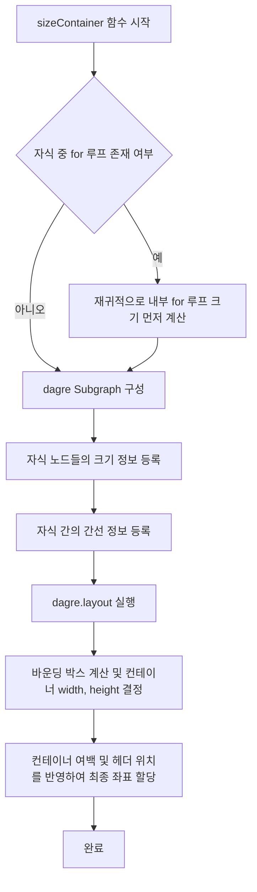

# 순서도 중첩 루프 내부 레이아웃 개선 사항 문서

이 문서는 `for` 루프 컨테이너 내부에서 `if`나 `while`과 같은 분기/반복 구조가 가로로 겹쳐서 출력되던 레이아웃 버그의 원인 및 해결 방법에 대해 설명합니다.

## 1. 문제 원인 (Problem Cause)

기존의 순서도 DSL → React Flow 변환 단계(`dslToGraph`)에서 `for` 루프 내부 자식 노드들의 레이아웃 배치 로직에 한계가 있었습니다.

* **수직 스택 배치**:
  기존 [flow-graph.ts](file:///Users/monicx/projects/claude-projects/flow-py-v2/src/lib/flow-graph.ts)의 `sizeContainer` 함수는 `for` 루프 내부에 존재하는 자식 노드(`kids`)들을 정렬한 후, 고정된 패딩(`PAD = 20`)을 X 좌표로 사용하고 세로 방향으로만 쌓아 내렸습니다.
  ```typescript
  // 기존 코드 예시
  k.position = { x: PAD, y };
  y += kh + GAP;
  ```
* **가로 분기(Branching) 무시**:
  `for` 루프 내부에 `if` 문이 들어가는 경우, `if` 문의 참(`True`)과 거짓(`False`) 분기는 가로로 나란히(Horizontal) 배치되어야 합니다. 하지만 모든 자식 노드들의 X 좌표가 `PAD`(20)로 강제 고정되면서 분기된 노드들이 가로로 정렬되지 못하고 세로축 상의 같은 위치에 포개어져 겹치는 버그가 발생했습니다.

---

## 2. 해결 방법 (Solution)

`for` 루프 컨테이너 내부 레이아웃 또한 최상위 노드 레이아웃과 마찬가지로 **`dagre` 그래프 레이아웃 엔진을 사용하여 재귀적으로 자동 배치**되도록 수정했습니다.

### 개선된 레이아웃 프로세스 (`sizeContainer` 동작 흐름)



1. **내부 컨테이너 선 계산**:
   자식 노드 중에 다른 `for` 루프가 있다면 `sizeContainer`를 재귀적으로 호출하여 하위 컨테이너의 가로/세로 크기(`width`, `height`)를 먼저 확정합니다.
2. **Dagre 서브그래프 생성**:
   자식 노드들만을 꼭짓점(Node)으로 하고, 자식들 간의 흐름을 나타내는 내부 간선(Edge)들만으로 구성된 독립적인 `dagre.graphlib.Graph`를 생성합니다.
3. **상대 좌표 계산**:
   `dagre.layout()`을 실행하여 자식 노드들이 가로 분기 구조에 맞추어 서로 겹치지 않게 정렬된 상대 좌표들을 얻어냅니다.
4. **바운딩 박스 측정 및 스케일링**:
   배치 결과에서 가장 왼쪽/오른쪽/위/아래의 경계를 계산(Bounding Box)하여 컨테이너의 최적 크기를 동적으로 설정하고, 좌우 `PAD`(20)와 상단 `HEADER`(30) 오프셋을 적용해 자식 노드들의 상대 좌표를 재조정합니다.

---

## 3. 개선 효과

* **분기문 정상 렌더링**: `for` 루프 내부에 `if`, `while` 등이 삽입되었을 때, 참/거짓 분기가 서로 겹치지 않고 온전하게 좌우로 정렬되어 시각적 가독성이 확보됩니다.
* **직관적인 간선 분기 (Edge Routing)**: 
  기존에는 `if`, `while` 조건문 마름모(Diamond)의 하단(`bottom`) 핸들에서 두 갈래의 참/거짓 선이 뻗어나와 겹치며 갈라졌습니다. 이를 수정하여 **참/거짓 대상 노드의 상대적 좌우 위치(`position.x`)에 따라 조건문의 좌측(`left`) 또는 우측(`right`) 핸들에서 직접 분기**하도록 개선했습니다. 이로 인해 마름모 바로 아래쪽에서 선들이 지저분하게 겹치는 현상이 해소되었습니다.
* **유연한 크기 조절**: 루프 내부 구조가 단순하면 작은 크기로, 복잡하여 좌우로 넓어지면 컨테이너가 알아서 가로/세로로 커져 레이아웃이 깨지지 않습니다.

---

## 4. 검증 및 테스트 코드

구현의 정확성을 검증하기 위해 [flow-graph.test.ts](file:///Users/monicx/projects/claude-projects/flow-py-v2/src/test/flow-graph.test.ts) 테스트 코드를 신설하여 아래 사항을 검증하고 있습니다.

* `for` 루프 안에 `if` 분기가 들어간 DSL 파싱 시, 참/거짓 분기 노드들이 다른 X 좌표를 갖는지 체크
* 자식들의 분기 여부에 따라 `for` 컨테이너의 `width`가 정상적으로 늘어나는지 체크
* 모든 자식 노드의 좌표가 컨테이너 한계(`PAD`, `HEADER`)를 벗어나지 않고 내부에 안착하는지 체크

```bash
bun test src/test/flow-graph.test.ts
```

---

## 5. 학생/조회 화면 확대 및 이동 기능 추가 (Flowchart Zoom & Pan Support)

기존에는 학생 문제 풀이 화면(`/solve/:id`) 등 읽기 전용 모드(`editable = false`)에서 캔버스가 고정되어 큰 순서도를 확인하기 어려웠습니다. 이를 개선하기 위해 아래 기능을 추가했습니다.

* **확대/축소 및 이동 기능 항시 활성화**:
  * 마우스 드래그를 통한 캔버스 이동 (`panOnDrag = true`)
  * 마우스 휠 스크롤을 통한 확대/축소 (`zoomOnScroll = true`)
  * 트랙패드 핀치 줌을 통한 확대/축소 (`zoomOnPinch = true`)
  * 더블 클릭을 통한 확대 (`zoomOnDoubleClick = true`)
  * 읽기 전용 상태이므로 노드 이동(`nodesDraggable`) 및 연결(`nodesConnectable`)은 불가능하며, 순수 캔버스 탐색만 활성화됩니다.
* **네비게이션 컨트롤러(Controls) 표시**:
  * 읽기 전용 모드에서도 캔버스 좌하단에 확대(`+`), 축소(`-`), 전체보기(`Fit View`) 버튼을 항상 노출하여 마우스 휠을 쓰지 않더라도 편리하게 화면을 조정할 수 있도록 지원합니다.

