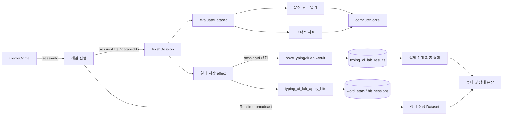

# AI 타이핑 연구소 결과·문장 생성 분석 및 보정

작성일: 2026-07-18

## 결론

2026-07-18 보정으로 승패 표시, 공통 0~100점 계산, 실제 상대 Dataset 문장 생성, 결정적 문장 후보 생성, 세션 멱등 저장을 적용했다. `TEST-07`도 사용자와 같은 Dataset 평가와 점수 공식을 사용한다.

문장 수는 단어 개수가 아니라 유효한 방향 관계 조합 수로 결정된다. 엔진은 모든 유효 조합을 먼저 열거하고 seed 기반으로 최대 12개를 선택하므로, 기존 48회 무작위 재시도에서 발생하던 누락은 없다.

## 구현 결과

- 게임과 결과에 `sessionId`를 전파하고 프런트 저장을 세션당 한 번으로 잠갔다.
- `typing_ai_lab_results`는 `(user_id, session_id)`로 upsert하며 Dataset ID를 함께 저장한다.
- 3인자 `typing_ai_lab_apply_hits` RPC는 동일 세션·동일 payload 재호출을 누적하지 않고, 다른 payload는 거부한다.
- 문장 후보를 전부 열거·중복 제거한 뒤 최대 12개를 선택한다.
- `Inference Capacity`는 `min(유효 조합 수, 12) / 12`로 계산한다.
- 관사는 명사구의 첫 발음 단어를 사용하므로 `an old book`이 생성된다.
- curated 동사 frame을 42개로 늘리고 문장 생성 관계 품질 검사를 빌드에 추가했다.
- 상대 Dataset ID와 최종 점수를 동기화해 실제 상대 문장을 만들고 `승리`·`패배`·`무승부`를 표시한다.
- 개인학습 결과는 `이번 세션 새로 숙련 완료`, 도감은 `학습 중`과 `숙련 완료`를 서로 배타적으로 표시한다.

아래 1~6장은 수정 전 현상의 원인과 제보 결과를 보존한 분석이다.

## 1. 결과 점수

제보 결과:

| 항목 | 점수 | 가중치 | 반영 점수 |
| --- | ---: | ---: | ---: |
| Accuracy | 97 | 20% | 19.4 |
| Dataset | 73.5 | 20% | 14.7 |
| Density | 0.5 | 25% | 0.125 |
| Coverage | 100 | 15% | 15 |
| Inference | 10.4 | 20% | 2.08 |
| 합계 |  |  | 51.305 → 51.3 |

`51.3`은 현재 공식대로 계산된 값이며 50점 이상이므로 `Grade C`가 맞다.

- `Dataset`: 획득 단어 수를 개인 경쟁 풀 크기로 나눈 값
- `Density`: 데이터셋 단어 사이에 실제 관계가 얼마나 촘촘한지 계산한 값
- `Coverage`: 8개 카테고리 중 포함된 카테고리 비율
- `Inference`: 48회 문장 생성 시도 중 고유 문장 생성에 성공한 비율

## 2. 승자가 표시되지 않는 이유

### 2.1 결과 화면이 승자를 계산하지 않음

`TypingAILab.tsx`의 경쟁 결과 화면은 다음 정보만 렌더링한다.

- 내 등급과 총점
- 상대 이름
- 상대 Dataset 크기
- 상대의 진행 중 예상값

내 점수와 상대 점수를 비교해 `승리`, `패배`, `무승부`를 만드는 로직이 없다.

### 2.2 실제 대전의 서버 판정은 화면과 연결되지 않음

실제 2인 매치에서는 `typing_ai_lab_finish_match` DB 함수가 두 참가자의 `total_score`를 비교해 최고 점수 사용자에게 승리 보너스를 준다. 그러나 클라이언트 결과 화면은 갱신된 `players[].total_score`를 사용해 승자를 표시하지 않는다.

즉, 서버에는 승리 보너스 판정이 있지만 결과 화면에는 판정 결과가 전달되지 않는다.

### 2.3 TEST-07은 최종 점수가 없음

테스트 매치에는 사용자만 `players`에 들어가고 TEST-07의 최종 결과 행은 만들지 않는다. 게임 종료 시 테스트 매치는 DB 완료 함수도 호출하지 않는다.

또한 TEST-07의 예상값은 0.9초마다 아래 방식으로 증가한다.

```text
이전 예상값 + 0~2.4 사이 난수
```

상한이나 실제 점수 공식이 없어 100을 넘을 수 있다. 따라서 `예상 249.5`는 점수가 아니며 승자 판정에 사용하면 안 된다.

실제 사람 상대의 진행 예상값도 최종 Inference 점수를 제외한 중간값이므로 최종 점수와 완전히 같지는 않다.

## 3. 문장 생성 절차

문장 생성은 LLM이 아니라 `game.ts`의 규칙 기반 엔진이다.

### 3.1 단어 분류

획득한 Dataset ID를 사전 정의와 연결한 뒤 품사별로 나눈다.

- 명사: `pos === "noun"`
- 형용사: `pos === "adj"`
- 동사: `pos === "verb"`이면서 `frame`이 있는 단어만 사용

동사로 분류돼도 `frame`이 없으면 문장 생성에는 사용할 수 없다.

### 3.2 지원 문장 틀

| 템플릿 | 형태 | 필수 방향 관계 |
| --- | --- | --- |
| `adj_noun` | `a fast car` | 형용사 → 명사 `Describes` |
| `sv` | `the doctor writes` | 명사 → 동사 `CapableOf` |
| `svo` | `the doctor writes a story` | `CapableOf` + 동사 → 목적어 `ActsOn` |
| `sv_loc` | `the child runs in the park` | `CapableOf` + 주어 → 장소 `AtLocation` |

관계뿐 아니라 `semanticTypes`도 동사의 주어·목적어·장소 타입과 겹쳐야 한다. 품사만 맞는 임의 조합은 허용하지 않는다.

### 3.3 무작위 생성과 중복 제거

1. 최대 48회 시도한다.
2. 매 시도마다 4개 템플릿 중 하나를 무작위로 고른다.
3. 조건을 만족하는 단어 조합을 찾는다.
4. 이미 생성한 문장과 같으면 버린다.
5. Dataset에 없는 내용어가 포함되면 버린다.
6. 최대 12개의 고유 문장을 저장한다.

`Inference Success`는 생성된 문장 수를 전체 가능 문장 수로 나눈 값이 아니다. `48회 중 중복되지 않은 성공 횟수`다. 같은 유효 문장을 다시 뽑아도 실패로 계산된다.

## 4. 제보 데이터셋 86개 분석

제보된 단어를 현재 사전과 관계 데이터로 직접 분석한 결과다.

### 4.1 품사 구성

| 품사 | 개수 |
| --- | ---: |
| 명사 | 39 |
| 동사 | 34 |
| 형용사 | 13 |

표면적으로는 문장을 만들기에 충분하다.

### 4.2 실제 사용 가능한 동사

34개 동사 중 문장 생성용 `frame`이 있는 동사는 다음 2개뿐이다.

- `write`
- `teach`

나머지 32개 동사는 `frame`이 없어 생성 후보에서 즉시 제외된다.

`teach`는 현재 Dataset 내부에서 필요한 `CapableOf` 관계를 만족하는 주어가 없어 실제 문장을 만들지 못한다.

### 4.3 가능한 고유 조합

| 템플릿 | 가능한 조합 수 | 조합 |
| --- | ---: | --- |
| `adj_noun` | 2 | `fast car`, `cold water` |
| `sv` | 1 | `doctor write` |
| `svo` | 3 | `doctor write story`, `doctor write book`, `doctor write message` |
| `sv_loc` | 0 | 없음 |
| 합계 | 6 |  |

86개 단어 사이 가능한 무방향 쌍은 3,655개지만, 데이터셋 내부의 방향 관계는 19개뿐이다. 그중 문장 템플릿 조건을 모두 만족하는 조합은 6개다.

결과에 표시된 문장 5개:

- `cold water`
- `a fast car`
- `the doctor writes a story`
- `the doctor writes`
- `the doctor writes a book`

가능하지만 이번 48회 무작위 시도에서 선택되지 않은 문장:

- `the doctor writes a message`

따라서 `Inference Success 10.4%`는 `5 / 48 = 10.416...%`를 반올림한 값이다.

## 5. 추가로 확인된 문제

### 5.1 상대 문장은 실제 상대 데이터가 아님

결과 화면의 `상대 생성 문장`은 상대가 획득한 Dataset을 받지 않는다. 내 경쟁 풀을 섞은 뒤 상대의 Dataset 크기만큼 잘라 가상으로 생성한다.

따라서 TEST-07에 표시된 문장은 상대가 실제로 수집한 단어의 결과가 아니다.

### 5.2 `a old book` 관사 오류

`adj_noun`은 관사를 형용사가 아닌 명사의 첫 글자로 결정한다. `book` 기준으로 `a`를 붙이기 때문에 `a old book`이 생성된다. 실제 영어 관사는 명사구에서 처음 발음되는 `old`를 기준으로 `an old book`이어야 한다.

## 6. 개인학습 획득 수 불일치 분석

제보 현상:

- 개인학습 종료 화면: 획득 단어 0개
- 같은 세션 종료 후 도감: 획득 단어 약 50개

이 현상은 현재 코드가 “획득”이라는 용어를 서로 다른 기준으로 사용해서 발생한다.

### 6.1 세션 종료 화면의 획득 기준

개인학습에서 단어는 난이도에 따라 누적 정타 목표를 채워야 `result.dataset`에 들어간다.

| 난이도 | 숙련 목표 |
| --- | ---: |
| Lv.1 | 3회 |
| Lv.2 | 4회 |
| Lv.3 | 5회 |
| Lv.4 | 6회 |
| Lv.5 | 7회 |

종료 화면의 `lootIds`는 다음 순서로 결정된다.

1. 저장 후 `newlyMastered`가 있으면 그 목록
2. 없으면 세션 중 목표 횟수를 채운 `result.dataset`

따라서 여러 단어를 각각 한두 번씩 정확히 입력했지만 어느 단어도 목표 3~7회를 넘지 못했다면 종료 화면은 `획득 0`으로 표시한다. 이 화면에서 “획득”은 사실상 “이번 세션에서 새로 숙련 완료”라는 뜻이다.

### 6.2 도감의 획득 기준

도감은 기준이 다르다.

```text
획득 = 누적 정타 수가 1 이상
숙련 = 누적 정타 수가 난이도별 목표 이상
```

개인학습 종료 시 `sessionHits`에는 정답을 한 번이라도 입력한 모든 단어가 들어간다. 이 값은 로컬 저장소와 DB의 `correct_count`에 누적된다. 도감은 `correct_count > 0`인 단어를 모두 “획득”으로 표시한다.

예를 들어 한 세션에서 서로 다른 단어 50개를 각각 한 번씩 입력하면:

- 종료 화면 새로 숙련 완료: 0개
- 도감 획득: 50개
- 도감 숙련 완료: 0개

제보된 수치와 정확히 일치하는 구조다. 데이터가 갑자기 생긴 것이 아니라, 종료 화면과 도감이 같은 단어 상태를 다른 이름으로 보여주고 있다.

### 6.3 누적 저장 흐름

1. 게임 중 단어 정답마다 `sessionHits[wordId]`가 1 증가한다.
2. 세션 중 `baselineMastery + sessionHits`가 목표에 도달하면 `result.dataset`에 추가한다.
3. 종료 후 `applyHitsLocally`가 모든 `sessionHits`를 로컬 누적값에 더한다.
4. `typing_ai_lab_apply_hits` RPC가 같은 hit를 DB `correct_count`에 더한다.
5. `refreshStats`는 로컬과 DB 중 큰 값을 선택한다.
6. 도감은 이 누적값이 1 이상이면 획득으로 표시한다.

로컬과 DB를 함께 쓰는 것 자체는 오프라인 복구를 위한 구조다. 정상적으로 한 번씩 실행되면 `max(local, DB)` 병합 때문에 단순히 두 배가 되지는 않는다.

### 6.4 별도의 중복 저장 위험

결과 저장 `useEffect`는 의존성에 매 렌더마다 새 객체가 되는 `competition`을 포함한다. 그런데 effect 내부에서 다음 상태를 변경한다.

- `setSaving`
- `setMastery`
- `setNewlyMastered`

`savedRef.current`가 마지막 단계에서만 `true`가 되므로, 저장 도중 렌더가 다시 발생하면 effect가 재시작될 수 있다. 서버 RPC `typing_ai_lab_apply_hits`는 세션 ID 기반 멱등 처리가 없고 호출될 때마다 `correct_count`를 더한다.

따라서 한 세션의 hit가 DB에 중복 누적될 가능성이 있다. 제보된 “도감 약 50개 획득”은 기준 불일치만으로 설명되지만, 일부 단어의 카운트가 예상보다 빠르게 3~7에 도달했다면 이 중복 실행 문제도 함께 의심해야 한다.

현재 테스트는 다음만 확인한다.

- 목표 횟수 전에는 세션 Dataset에 들어가지 않음
- 목표 횟수에 도달하면 Dataset에 들어감
- 도감 획득은 1회 이상, 숙련은 목표 이상

React 결과 저장 effect가 정확히 한 번만 RPC를 호출하는지는 테스트하지 않는다.

### 6.5 권장 용어

두 화면의 의미를 맞추려면 다음처럼 분리해야 한다.

| 상태 | 권장 표시 |
| --- | --- |
| 정타 1회 이상 | 발견 또는 학습 중 |
| 목표 3~7회 달성 | 획득 또는 숙련 완료 |
| 이번 세션에서 처음 목표 달성 | 이번 세션 획득 |

가장 작은 UI 수정은 종료 화면의 `획득`을 `새로 숙련 완료`로 바꾸고, 도감의 `획득`을 `학습 시작` 또는 `발견`으로 바꾸는 것이다.

## 7. 적용 완료 항목

1. 개인학습 결과 저장의 세션당 1회 잠금
2. 서버 hit 누적 RPC의 세션 멱등 처리
3. `학습 중`, `숙련 완료`, `이번 세션 새로 숙련 완료` 용어 분리
4. TEST-07의 공통 0~100점 계산과 최종 점수 확정
5. 승리·패배·무승부와 양쪽 최종 점수 표시
6. 실제 대전 참가자의 저장된 최종 점수와 Dataset ID 조회
7. 모든 유효 문장 조합 열거와 최대 12개 seed 선택
8. 동사 frame·방향 관계 확충 및 사전 빌드 품질 검사
9. `Inference Capacity`를 생성 가능한 조합 수 기반으로 계산
10. 형용사구의 첫 발음 기준 관사 선택

## 8. 관련 코드

- `src/features/typing-ai-lab/game.ts`
  - `tryBuildSentence`
  - `generateSentences`
  - `computeScore`
  - `finishSession`
- `src/features/typing-ai-lab/TypingAILab.tsx`
  - 경쟁 진행 예상값 방송
  - `opponentSentences`
  - 경쟁 결과 화면
  - `applyHitsLocally`
  - 개인학습 결과 저장 effect
- `src/features/typing-ai-lab/LexiconCatalog.tsx`
  - 도감의 획득·숙련 판정
- `src/features/typing-ai-lab/progression.ts`
  - 난이도별 숙련 및 해금 판정
- `src/features/typing-ai-lab/useTypingAiCompetition.ts`
  - TEST-07 예상값 시뮬레이션
  - 실제 매치 참가자 점수 폴링
- `supabase/migrations/0024_typing_practice_points.sql`
  - 실제 2인 매치 서버 승자 판정과 보너스
- `supabase/migrations/0026_db_lint_fixes.sql`
  - 개인학습 hit 누적 RPC
- `supabase/migrations/0039_typing_ai_lab_result_integrity.sql`
  - 결과 및 hit의 세션 멱등 처리, Dataset ID 저장

## 9. 리팩토링 계획과 설계 이유

### 9.1 목표

이번 리팩토링은 화면의 표시 오류만 고치는 작업이 아니라 다음 불변 조건을 보장하는 작업이다.

1. 한 학습 세션의 hit와 결과는 한 번만 저장된다.
2. 사용자와 상대는 동일한 0~100점 공식을 사용한다.
3. 상대 문장은 상대가 실제로 수집한 Dataset으로만 생성한다.
4. 같은 Dataset과 seed는 같은 문장 결과를 만든다.
5. 학습 진행과 숙련 완료를 같은 의미로 표시하지 않는다.
6. 사전에 frame이 있어도 필요한 방향 관계가 없으면 빌드 단계에서 발견한다.

### 9.2 단계별 리팩토링 계획

| 단계 | 변경 | 이유 |
| --- | --- | --- |
| 세션 정체성 | 게임 생성 시 UUID `sessionId` 발급 후 결과까지 전달 | React 렌더 횟수와 저장 단위를 분리하기 위해 |
| 클라이언트 잠금 | 결과 저장 전에 `Set<sessionId>`로 선점 | StrictMode의 effect 재실행과 상태 변경 중복 호출을 차단하기 위해 |
| DB 멱등성 | 사용자·세션 unique key와 hit 처리 세션 테이블 추가 | 네트워크 재시도나 다중 탭에서도 중복 누적을 막기 위해 |
| 문장 엔진 | 무작위 재시도를 전체 후보 열거 후 seed 선택으로 변경 | 생성 가능한 문장을 운에 따라 놓치지 않기 위해 |
| 공통 평가 | `evaluateDataset`에서 그래프·문장·점수를 함께 계산 | 사용자와 TEST-07의 점수 공식을 하나로 유지하기 위해 |
| 상대 동기화 | 진행 중 broadcast와 종료 결과에 Dataset ID 포함 | 내 단어로 만든 가상 상대 결과를 제거하기 위해 |
| 사전 품질 | frame과 방향 관계 확충, ETL 품질 검사 추가 | 품사는 충분하지만 생성 가능한 문장이 없는 상태를 줄이기 위해 |
| UI 의미 분리 | 학습 중·숙련 완료·이번 세션 신규 숙련을 분리 | 서로 다른 판정을 같은 “획득”으로 표시하던 혼동을 없애기 위해 |

## 10. 관련 로직 구성

### 10.1 전체 데이터 흐름



### 10.2 개인학습 저장

```text
게임 시작
  sessionId 생성
  baselineMastery 로드

정답 입력
  sessionHits[wordId] += 1
  baselineMastery + sessionHits가 목표에 도달하면 세션 신규 숙련에 추가

게임 종료
  저장 Set에 sessionId가 있으면 종료
  없으면 먼저 sessionId를 Set에 추가
  로컬 숙련도를 즉시 반영
  applySessionHits(sessionHits, sessionId) 호출
  saveTypingAiLabResult(result) upsert
```

클라이언트 잠금은 불필요한 중복 요청을 줄이고, DB 멱등성은 클라이언트 잠금만으로 막을 수 없는 재시도·다중 탭·네트워크 중복을 최종 차단한다. 둘 중 하나만 사용하면 정확성을 완전히 보장할 수 없다.

### 10.3 DB 멱등 처리

`0039_typing_ai_lab_result_integrity.sql`은 다음 구조를 추가한다.

| 구조 | 역할 |
| --- | --- |
| `typing_ai_lab_results.session_id` | 결과를 생성한 게임 세션 식별 |
| `typing_ai_lab_results.dataset_ids` | 표시 문자열이 아닌 실제 단어 ID 보존 |
| `(user_id, session_id)` unique | 같은 세션 결과의 중복 insert 방지 |
| `typing_ai_lab_hit_sessions` | 어떤 세션 payload가 이미 누적됐는지 기록 |
| 3인자 `typing_ai_lab_apply_hits` | 세션 선점 후 최초 호출만 hit 누적 |

동일한 `sessionId`와 동일한 payload가 다시 오면 현재 누적값만 반환한다. 동일 세션에 다른 payload가 오면 데이터 손상을 막기 위해 `session payload mismatch` 오류를 발생시킨다. 기존 2인자 RPC는 이전 클라이언트 호환을 위해 유지한다.

### 10.4 문장 생성 엔진

문장 생성은 다음 순서로 수행한다.

```text
Dataset ID를 WordDef로 변환
  명사 / 형용사 / frame 보유 동사로 분류

각 템플릿의 모든 조합 열거
  adj_noun: Describes + semanticTypes
  sv: CapableOf + subject frame
  svo: sv 조건 + ActsOn + object frame
  sv_loc: sv 조건 + AtLocation + location frame

validateSentenceText로 Dataset 포함 여부와 방향 관계 재검증
문장 text 기준 중복 제거
seed 기반 Fisher-Yates 셔플
최대 12개 선택
Inference Capacity = min(유효 후보 수, 12) / 12
```

후보를 먼저 전부 계산하므로 재시도 횟수나 템플릿 추첨 운이 결과에 영향을 주지 않는다. seed는 표시 순서만 결정한다.

### 10.5 점수와 경쟁 판정

`evaluateDataset`은 양쪽 참가자에게 공통으로 다음 값을 계산한다.

- Dataset 크기와 경쟁 풀 대비 비율
- 관계 그래프 Density
- 카테고리 Coverage
- 문장 생성 Inference Capacity
- Accuracy를 포함한 최종 0~100점

실제 대전은 진행 중 Realtime payload의 `datasetIds`를 미리보기용으로 사용하고, 종료 후 `typing_ai_lab_results.dataset_ids`와 참가자 `total_score`를 확정값으로 사용한다. TEST-07도 seed 기반 Dataset 수집을 시뮬레이션한 뒤 같은 `evaluateDataset`과 `computeScore`를 거친다.

승패 판정은 양쪽 최종 점수가 준비된 뒤에만 수행한다.

```text
내 점수 > 상대 점수  → 승리
내 점수 < 상대 점수  → 패배
내 점수 = 상대 점수  → 무승부
상대 점수 미확정      → 결과 대기
```

## 11. 사용 기술과 선택 이유

| 기술 | 사용 위치 | 선택 이유 |
| --- | --- | --- |
| React state/effect/ref | 게임 화면과 저장 제어 | UI 상태와 세션 잠금을 컴포넌트 생명주기에 맞춰 관리 |
| TypeScript | 게임·점수·경쟁 데이터 | `sessionId`, Dataset ID, 확정 점수의 누락을 정적으로 검사 |
| Supabase PostgreSQL | 결과·숙련 누적 | unique constraint와 트랜잭션으로 최종 멱등성 보장 |
| PL/pgSQL RPC | hit 원자적 누적 | 세션 선점과 숙련 카운트 갱신을 하나의 트랜잭션에서 처리 |
| Supabase Realtime | 상대 진행 정보 | 경기 중 Dataset과 예상 점수를 낮은 지연으로 동기화 |
| seed 기반 PRNG | 문장 순서·TEST-07 | 같은 입력의 재현 가능한 결과 제공 |
| 규칙 기반 지식 그래프 | 문장 생성 | LLM 호출 없이 품사·의미 타입·방향 관계를 검증 |
| Python ETL | 정적 사전 생성 | 대규모 어휘·관계 데이터를 빌드 시점에 검증하고 압축 |
| Vitest | 점수·문장·상태 회귀 검사 | 브라우저 UI와 분리된 순수 로직을 빠르게 검증 |
| ESLint/Vite | 정적 검사·프로덕션 빌드 | Hook 의존성, 타입 변환, 번들 생성 문제 확인 |

## 12. 검증 기준

| 검증 항목 | 기대 결과 |
| --- | --- |
| 같은 seed와 Dataset으로 두 번 생성 | 문장 목록과 순서가 동일 |
| 유효 후보가 6개 | 문장 6개, Inference Capacity 50% |
| `old + book` | `an old book` |
| 사용자·TEST-07 점수 | 모두 0~100 범위 |
| 점수 비교 | 승리·패배·무승부가 정확히 반환 |
| 게임 종료 결과 | 시작 시 생성한 `sessionId` 유지 |
| 같은 세션·같은 hit payload 재호출 | DB 카운트 추가 증가 없음 |
| 같은 세션·다른 payload 재호출 | RPC 오류 |
| 사전 재생성 | frame 최소 수와 필수 방향 관계 검사 통과 |

자동 검증은 타이핑 연구소 단위 테스트, 전체 Vitest, ESLint, Vite 프로덕션 빌드, `build:lexicon`, Supabase DB lint로 구성한다. RPC 재호출의 실제 누적 여부는 로컬 Supabase 통합 테스트 또는 마이그레이션 검증 SQL로 추가 확인하는 것이 안전하다.
