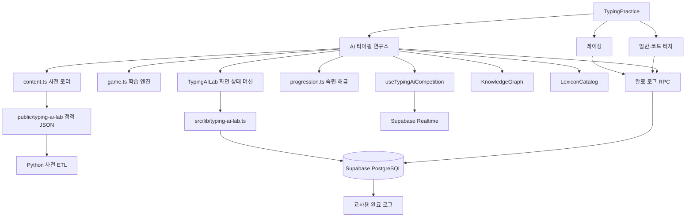

# 타자 연습 및 AI 타이핑 연구소 구현 보고서

> 작성일: 2026-07-18  
> 대상 프로젝트: Flow Python v2  
> 주요 범위: 타자 연습 UI, AI 타이핑 연구소, 실시간 경쟁, 학습 이력, 포인트 지급

## 1. 보고서 개요

이번 작업은 기존 타자 연습 화면에 게임형 시각 체계를 적용하고, AI 타이핑 연구소를 단순 타자 입력 화면이 아닌 다음 기능을 가진 학습 시스템으로 확장하는 작업이다.

- 난이도별 영어 단어 사전
- 사용자별 누적 숙련도
- 숙련도 기반 단계 해금
- 관계 그래프를 활용한 단어 출제
- 수집 단어 기반 지식 그래프와 문장 추론
- 2인 실시간 경쟁과 전역 랭킹
- 오프라인 테스트 상대
- 모든 타자 모드의 완료 로그
- 모드별 차등 포인트 지급
- 교사용 학생 완료 기록 화면

여기서 “AI 연구소”의 AI는 외부 LLM API를 실시간 호출하는 구조가 아니다. 브라우저에서 재현 가능하고 빠르게 동작하도록, 오프라인에서 구축한 어휘 데이터와 의미 관계 그래프를 이용하는 결정적 규칙 기반 학습 엔진으로 구현했다.

## 2. 핵심 결과

### 2.1 사용자 경험

- 시작 화면과 게임 화면에 각각 전용 이미지 배경을 적용했다.
- 전체 연구소 화면을 사이버 연구 콘솔 형태로 통일했다.
- 개인 학습, 경쟁, 대기, 카운트다운, 게임, 분석, 결과, 랭킹, 단어 도감을 하나의 시각 언어로 구성했다.
- 게임 종료 시 확인 대화상자를 표시한다.
- 각 하위 화면의 뒤로가기는 타자 연습 전체를 종료하지 않고 AI 연구소 메뉴로 돌아간다.
- 학습 모드 단어 카드는 불필요한 hover 효과를 제거해 입력 집중도를 높였다.
- 경쟁 모드는 숙련 단어 수와 무관하게 대기열에 입장할 수 있다.
- 실제 상대가 없을 때 대기 화면에서 `TEST-07` 테스트 상대를 시작할 수 있다.

### 2.2 학습 시스템

- 단어별 정답 횟수를 로컬과 Supabase에 누적한다.
- 단어 난이도에 따라 3~7회의 정답을 숙련 기준으로 사용한다.
- 현재 난이도 단어를 40개 이상 또는 40% 이상 숙련하면 다음 난이도가 열린다.
- 숙련 완료 단어는 개인 학습 출제 대상에서 제외한다.
- 관계성, 카테고리 부족분, 콤보, 최근 입력, 최근 출제 이력을 가중치로 사용해 다음 단어를 선택한다.

### 2.3 운영 데이터

- 학생이 각 타자 모드를 완료하면 모드, 타수, 포인트, 완료 시각을 기록한다.
- 교사는 최근 완료 기록 100건을 확인할 수 있다.
- 포인트 로그와 완료 로그를 DB 함수 안에서 원자적으로 기록한다.
- AI 경쟁 승리 보너스는 클라이언트가 아니라 서버가 최종 점수를 비교해 지급한다.

## 3. 적용 기술

| 영역 | 적용 기술 |
| --- | --- |
| 프런트엔드 | React 18, TypeScript, Vite |
| UI | Tailwind CSS, lucide-react |
| 상태 관리 | React `useState`, `useMemo`, `useEffect`, `useCallback`, `useRef` |
| 백엔드 | Supabase PostgreSQL, Auth, Realtime |
| 실시간 통신 | Supabase Presence, Broadcast, DB 상태 폴링 |
| 데이터 보안 | PostgreSQL RLS, `security definer` RPC |
| 로컬 복구 | `localStorage` |
| 그래프 시각화 | SVG, 자체 force-directed layout |
| 사전 ETL | Python, wordfreq, Princeton WordNet, Wiktionary en→ko |
| 테스트 | Vitest |

## 4. 전체 구조



## 5. 주요 파일 구성

| 파일 | 역할 |
| --- | --- |
| `src/pages/TypingPractice.tsx` | 타자 연습 진입점, 레이싱·일반 연습·AI 연구소 연결, 완료 로그 수집, 교사용 로그 |
| `src/features/typing-ai-lab/TypingAILab.tsx` | AI 연구소 화면 상태, 학습 세션, 결과 저장, 공통 HUD |
| `src/features/typing-ai-lab/game.ts` | 단어 출제, 입력 판정, 콤보, 그래프, 문장 생성, 점수 계산 |
| `src/features/typing-ai-lab/content.ts` | 사전 타입, 정적 JSON 로딩, 인덱스와 관계 조회 |
| `src/features/typing-ai-lab/progression.ts` | 숙련도와 난이도 해금 |
| `src/features/typing-ai-lab/useTypingAiCompetition.ts` | 대기열, 실시간 매치, Presence, 진행 방송, 테스트 상대 |
| `src/features/typing-ai-lab/KnowledgeGraph.tsx` | 결과 지식 그래프 SVG 렌더링 |
| `src/features/typing-ai-lab/LexiconCatalog.tsx` | 단어 검색, 필터, 숙련 현황, 페이지네이션 |
| `src/lib/typing-ai-lab.ts` | Supabase 연구소 데이터 접근 계층 |
| `src/lib/typing-logs.ts` | 완료 로그와 포인트 RPC 호출, 교사용 로그 조회 |
| `scripts/typing-ai-lab/` | 영어 사전 ETL |
| `supabase/migrations/0021~0025` | 결과, 숙련도, 경쟁, 완료 로그, 포인트, 열린 대기열 |

## 6. UI 및 화면 구성 작업

### 6.1 배경

- 시작·메뉴 계열 화면: `public/typing-ai-lab/background.png`
- 게임 계열 화면: `public/typing-ai-lab/panel.png`
- `Shell` 컴포넌트가 화면 종류에 따라 배경을 선택한다.
- 배경 위에 어두운 오버레이, 그라데이션, 블러를 적용해 텍스트 가독성을 유지한다.

### 6.2 공통 UI 컴포넌트

`TypingAILab.tsx` 내부에 연구소 전용 UI를 구성했다.

- `Shell`: 전체 배경, 상단 상태, 타이틀, 뒤로가기
- `LabPanel`: 반투명 콘솔 패널
- `LabButton`: 기본·보조 버튼
- `MissionCard`: 개인 학습·경쟁 진입 카드
- `HudMetric`: 단계, 숙련 수, 해금까지 남은 수
- `Chip`: 정확도, 콤보, 데이터셋 크기
- `HudRow`: 사이드바 수치
- `ExitConfirmDialog`: 진행 중 종료 확인
- `NeuralActivity`: 연속 파형 애니메이션
- `CornerMarks`: 패널 모서리 장식

메뉴 카드와 패널은 배경 로봇이 보이도록 낮은 불투명도와 제한적인 블러를 사용했다. 게임 패널은 정보 판독이 중요하므로 메뉴보다 높은 불투명도를 사용한다.

### 6.3 화면 상태

AI 연구소 UI는 다음 상태를 가진다.

```text
menu
 ├─ lexicon
 ├─ ranking
 ├─ learning → countdown → playing → result
 └─ matchmaking → countdown → playing → training → result
```

내부 `Phase`는 다음 값을 사용한다.

- `menu`
- `ready`
- `countdown`
- `playing`
- `training`
- `result`
- `ranking`
- `lexicon`
- `matchmaking`

`ready`는 타입에 남아 있지만 현재 주요 진입 흐름에서는 직접 사용하지 않는다.

### 6.4 화면별 주요 변경

#### 메뉴

- 연구소 타이틀과 온라인 상태 표시
- 현재 해금 단계, 총 숙련 단어 수, 다음 단계까지 남은 수 표시
- 개인 학습과 실시간 경쟁을 미션 카드 형태로 제공
- 단어 도감과 경쟁 랭킹 진입 버튼 제공

#### 매칭 대기

- 실제 상대가 없으면 화면을 닫지 않고 대기 상태를 유지한다.
- 대기열 취소 버튼을 제공한다.
- 대기 중 `TEST-07과 테스트 시작` 버튼을 제공한다.

#### 게임

- 중앙 단어 보드와 우측 HUD를 하나의 수직 중심선에 배치했다.
- 상단에 남은 시간, 정확도, 콤보, 데이터셋 크기를 표시한다.
- 우측에 최근 획득 단어, 진행률, 상대 진행 상황을 표시한다.
- 빈 공간에는 `NeuralActivity` 파형을 배치했다.
- 개인 학습 단어 카드 hover는 제거했다.
- 게임 중 뒤로가기는 종료 확인 대화상자를 표시한다.

#### 결과

- 개인 학습 결과는 “학습완료”로 표시한다.
- 학습 정확도 등 핵심 수치를 완료 제목 옆으로 이동했다.
- 기존 메뉴·나가기 조합을 다시하기 중심으로 정리했다.
- 경쟁 결과는 점수, 등급, 데이터셋, 그래프, 추론 문장을 표시한다.

#### 랭킹

- 불필요한 트로피 장식을 제거했다.
- “메뉴로” 버튼을 제목 영역에 배치했다.
- 현재 사용자는 별도 테두리와 색상으로 구분한다.

#### 단어 도감

- 영어·한국어 뜻 검색
- 획득·숙련·미획득 상태 필터
- 난이도 필터
- 품사 필터
- 페이지당 60개 표시
- 전체·획득·숙련 수와 수집률 표시
- select chevron과 우측 패딩을 직접 제어해 브라우저별 표시 차이를 줄였다.

## 7. AI 연구소 어휘 데이터

### 7.1 데이터 모델

각 단어는 다음 정보를 가진다.

```typescript
interface WordDef {
  id: string;
  word: string;
  pos: "noun" | "verb" | "adj";
  categories: Category[];
  meaningKo: string;
  semanticTypes: SemanticType[];
  difficulty: number;
  frequency: number;
  countability: "count" | "mass" | "both";
  number: "singular" | "plural" | "invariant";
  forms?: {
    plural?: string;
    thirdPersonSingular?: string;
  };
  frame?: {
    subjects: SemanticType[];
    objects?: SemanticType[] | null;
    locations?: SemanticType[] | null;
  };
}
```

카테고리는 `human`, `education`, `technology`, `nature`, `place`, `object`, `animal`, `action`의 8종이다.

관계는 다음 7종이다.

- `RelatedTo`
- `IsA`
- `PartOf`
- `CapableOf`
- `AtLocation`
- `ActsOn`
- `Describes`

### 7.2 오프라인 ETL

브라우저가 외부 사전 API를 호출하지 않도록 사전을 빌드 시점에 생성한다.

입력 데이터:

- 검수된 핵심 단어와 문장 프레임: `curated_seed.json`
- 검수된 빈출 동사: `common_verbs.json`
- 영어 빈도: wordfreq
- 품사·관계: Princeton WordNet
- 한국어 뜻: Wiktionary en→ko

처리 과정:

1. 검수된 핵심 단어를 우선 등록한다.
2. wordfreq 후보를 WordNet 품사와 한국어 뜻 존재 여부로 필터링한다.
3. 검수된 동사를 병합하고 자동 번역보다 검수 뜻을 우선한다.
4. 표면형·ID 충돌을 정리한다.
5. 동사를 빈도순 5개 난이도로 균등 배치한다.
6. WordNet 관계와 검수 관계를 생성한다.
7. dangling relation과 필수 필드를 검증한다.
8. 난이도별 단어·관계 JSON과 manifest를 출력한다.

현재 manifest 기준:

- 단어 7,659개
- 동사 1,791개
- 관계 22,791개
- 난이도별 동사 358~359개

### 7.3 브라우저 로딩

`ensureLexicon(maxDifficulty)`는 필요한 난이도까지만 점진적으로 로딩한다.

- `manifest.json`을 먼저 읽는다.
- `words-d1.json`부터 필요한 난이도 JSON까지 읽는다.
- 같은 ID와 같은 관계를 중복 제거한다.
- 양 끝 단어가 아직 로딩되지 않은 관계는 제외한다.
- 단어 ID 인덱스, 무방향 인접 인덱스, 방향 관계 인덱스를 재구축한다.
- 이미 로딩된 단계는 다시 요청하지 않는다.

정적 파일에는 manifest 버전과 생성 시각을 query string으로 붙이고 `no-cache` 요청을 사용한다. 새 사전 배포 시 이전 JSON이 남는 문제를 줄이기 위한 방식이다.

## 8. 개인 학습 로직

### 8.1 세션 구성

- 세션 시간: 180초
- 동시 단어 슬롯: 25개
- 정답 슬롯 재충전 지연: 500ms
- 최근 출제 패널티 기준: 10초
- 입력은 앞뒤 공백 제거 후 소문자로 비교한다.

세션은 `GameState` 하나로 관리한다.

```text
seed
mode
poolIds
baselineMastery
startedAt / endsAt
slots
dataset
sessionHits
recentInputs / recentSpawns
combo / comboCategory
attempts / correctAttempts
lastAcquired
```

### 8.2 재현 가능한 난수

게임은 seed 기반 `Mulberry32` 계열 난수 생성기를 사용한다. 같은 seed와 같은 입력 조건이면 초기 단어 보드가 동일하다.

이 설계는 다음 목적을 가진다.

- 경쟁 참가자에게 같은 초기 조건 제공
- 테스트 재현성 확보
- 문제 상황 디버깅 용이

### 8.3 출제 풀

개인 학습 풀은 다음 조건으로 만든다.

```text
단어 난이도 <= 현재 해금 난이도
AND
현재 누적 정답 수 < 해당 단어 숙련 목표
```

즉 이미 숙련한 단어는 개인 학습에 다시 나오지 않는다.

### 8.4 출제 가중치

각 후보 단어의 가중치는 다음 식으로 계산한다.

```text
Weight = max(0, B × D + S + C + R - P + N)
```

| 기호 | 의미 | 계산 |
| --- | --- | --- |
| `B` | 기본 빈도 | 단어의 `frequency` |
| `D` | 난이도 역수 | `1 / difficulty` |
| `S` | 현재 데이터셋 연결성 | 데이터셋 단어와 후보 관계 가중치 합, 최대 5 |
| `C` | 카테고리·콤보 보정 | 부족 카테고리 보너스 + 동일 콤보 카테고리 |
| `R` | 최근 입력 연결성 | 최근 10개 정답 단어와의 관계 합 × 0.8 |
| `P` | 반복 패널티 | 이미 데이터셋이면 +4, 10초 내 출제 이력이 있으면 +3 |
| `N` | 학습 신규성 | 진행 중 단어 +2.5, 처음 보는 단어 +1.2 |

추가 제외 조건:

- 같은 단어 ID가 화면에 있으면 가중치 0
- 같은 표면형이 화면에 있으면 가중치 0
- 개인 학습에서 숙련 완료 단어는 가중치 0

최종 선택은 단순 최대값 선택이 아니라 weighted random이다. 따라서 관련 단어를 우선하면서도 출제가 완전히 고정되는 현상을 피한다.

### 8.5 풀 고갈 처리

출제 가능한 단어가 부족할 때 순차적으로 다음 fallback을 사용한다.

1. 현재 풀 안에서 화면에 없는 미숙련 단어
2. 현재 풀 안의 미숙련 단어
3. 개인 학습이면 전체 사전에서 화면에 없는 미숙련 단어
4. 최종적으로 화면에 없는 풀 단어

개인 학습에서는 fallback 과정에서도 숙련 단어를 다시 선택하지 않도록 별도로 검사한다.

## 9. 입력, 획득, 콤보

### 9.1 입력 판정

1. 입력 문자열을 `trim().toLowerCase()`로 정규화한다.
2. 현재 활성 슬롯에서 표면형이 정확히 같은 단어를 찾는다.
3. 없으면 전체 시도 수만 증가하고 콤보를 0으로 초기화한다.
4. 있으면 정답 수와 해당 단어의 세션 정답 횟수를 증가시킨다.
5. 맞힌 슬롯을 500ms 동안 비운 뒤 새 단어로 채운다.

### 9.2 개인 학습 획득

개인 학습에서는 한 번 맞혔다고 즉시 데이터셋에 들어가지 않는다.

```text
세션 시작 전 누적 정답 수
+ 이번 세션 정답 수
>= 숙련 목표
```

위 조건을 만족한 최초 시점에 해당 단어를 `dataset`과 최근 획득 목록에 추가한다.

### 9.3 경쟁 획득

경쟁 모드에서는 정답 1회에 바로 데이터셋에 추가한다. 경쟁은 제한 시간 안에 얼마나 빠르게 관계 있는 단어 집합을 구축하는지 비교하는 모드이기 때문이다.

### 9.4 콤보 기준

콤보는 단순 연속 정답 수가 아니라 **같은 주 카테고리의 연속 정답 수**다.

```text
정답 단어의 categories[0] == 현재 comboCategory
  → combo + 1

정답이지만 카테고리가 다름
  → combo = 1
  → comboCategory = 새 카테고리

오답
  → combo = 0
  → comboCategory = null
```

콤보는 점수에 직접 더해지지 않는다. 대신 동일 카테고리 단어의 출제 가중치를 높여 관계 있는 단어 흐름을 형성한다.

현재 결과 모델의 `comboPeak`에는 실제 최고 콤보가 아니라 세션 종료 시점 콤보가 들어간다. 이름과 실제 값이 다르므로 향후 최고 콤보를 별도 추적하려면 `GameState`에 peak 값을 추가해야 한다.

## 10. 숙련도 및 단계 해금

### 10.1 숙련 목표

```text
masteryTarget = clamp(difficulty + 2, 3, 7)
```

| 난이도 | 필요 정답 수 |
| ---: | ---: |
| 1 | 3 |
| 2 | 4 |
| 3 | 5 |
| 4 | 6 |
| 5 | 7 |

### 10.2 단계 해금

신규 사용자는 난이도 1에서 시작한다. 현재 단계에서 다음 조건 중 하나를 만족하면 다음 단계가 열린다.

- 숙련 단어 40개 이상
- 현재 단계 단어의 40% 이상 숙련

해금은 순차적으로 계산한다. 예를 들어 난이도 1 조건을 만족하지 않은 상태에서 난이도 3 단어 데이터가 존재하더라도 난이도 2가 자동으로 열리지 않는다.

### 10.3 로컬·DB 병합

숙련도는 다음 두 저장소를 사용한다.

- 로컬: `localStorage`
- 서버: `typing_ai_lab_word_stats`

초기 로딩 시 같은 단어에 대해 로컬 값과 DB 값 중 큰 값을 사용한다.

```text
mergedCount[wordId] = max(localCount, dbCount)
```

세션 종료 시:

1. 로컬 숙련도를 먼저 누적한다.
2. UI를 즉시 갱신한다.
3. DB RPC로 세션 정답을 배치 누적한다.
4. DB 성공 후 서버 값을 다시 읽어 병합한다.
5. DB 실패 시에도 로컬 진행은 유지한다.

이 방식은 일시적인 네트워크 오류가 학습 진행을 즉시 잃게 하지 않는 장점이 있다. 다만 로컬 데이터는 브라우저 저장소이므로 다른 기기 동기화의 최종 기준은 DB다.

### 10.4 DB 누적

`typing_ai_lab_apply_hits` RPC는 단어별 정답 수를 upsert한다.

- 신규 단어: 입력된 세션 정답 수로 생성
- 기존 단어: `correct_count + sessionHits`
- 최초 목표 도달 시 `mastered_at` 기록
- 응답으로 새 누적 수와 신규 숙련 여부 반환

## 11. 지식 그래프

### 11.1 그래프 지표

데이터셋의 고유 단어 수를 `n`이라고 할 때 가능한 무방향 쌍 수는 다음과 같다.

```text
possibleEdges = n × (n - 1) / 2
density = 실제 관계 쌍 수 / possibleEdges
```

카테고리 커버리지는 다음과 같다.

```text
coverage = 데이터셋에 존재하는 카테고리 수 / 전체 8개 카테고리
```

결과 표시에서는 방향 관계가 있으면 `CapableOf`, `ActsOn`, `AtLocation` 등의 실제 방향 간선을 우선 사용한다. 방향 간선이 하나도 없으면 무방향 `RelatedTo` 간선을 표시한다.

### 11.2 그래프 레이아웃

외부 그래프 레이아웃 런타임 없이 작은 force-directed layout을 직접 구현했다.

1. golden-angle spiral로 초기 좌표 생성
2. 노드 간 반발력 적용
3. 관계 간선에 스프링 힘 적용
4. 화면 중심으로 약한 중력 적용
5. 90회 반복하며 cooling 적용
6. 화면 경계 안으로 좌표 제한

노드 색상은 주 카테고리를 기준으로 결정한다. 노드 반지름은 연결 차수의 제곱근에 비례해 증가한다.

노드를 선택하거나 hover하면:

- 해당 노드와 이웃 관계를 강조
- 무관한 노드와 간선을 흐리게 표시
- 영어 단어와 한국어 뜻 툴팁 표시

키보드 Enter와 Space 선택도 지원한다.

## 12. 문장 추론

문장 생성은 데이터셋에 실제로 들어온 단어만 사용한다.

지원 템플릿:

| 템플릿 | 형태 | 기본 점수 |
| --- | --- | ---: |
| `svo` | 주어 + 동사 + 목적어 | 10 |
| `sv_loc` | 주어 + 동사 + 장소 | 9 |
| `sv` | 주어 + 동사 | 6 |
| `adj_noun` | 형용사 + 명사 | 5 |

### 12.1 의미 제약

문장은 품사만 맞는다고 생성하지 않는다.

- 주어는 동사 frame의 `subjects` semantic type과 일치해야 한다.
- 목적어는 `objects`와 일치하고 `ActsOn` 방향 관계가 있어야 한다.
- 장소는 `locations`와 일치하고 `AtLocation` 관계가 있어야 한다.
- 형용사와 명사는 `Describes` 관계가 있어야 한다.

예:

```text
child + eat + apple
```

`child → eat`의 `CapableOf` 관계와 `eat → apple`의 `ActsOn` 관계가 있으면 생성할 수 있다.

```text
child + eat + park
```

`park`가 장소라는 이유만으로 목적어가 되지는 않는다. `eat → park`의 `ActsOn` 관계가 없으므로 SVO 문장은 거부한다.

### 12.2 문법 처리

- 단수 주어에는 3인칭 단수 동사형 적용
- 단어에 검수 활용형이 있으면 우선 사용
- 가산성·수에 따라 `a`, `an` 또는 무관사 선택
- `hour`, `university` 등의 발음 기반 예외 처리
- 장소 종류에 따라 `in the` 또는 `at the` 선택

### 12.3 생성 제한과 검증

- 최대 48회 생성 시도
- 최대 12개 고유 문장
- 중복 문장 제외
- 데이터셋에 없는 내용어가 섞이면 최종 검증에서 제외
- 데이터셋에 동사가 없으면 `adj_noun`만 시도

추론 성공률:

```text
inferenceSuccess = 성공 문장 수 / 실제 생성 시도 수
```

## 13. 점수와 등급

### 13.1 구성 점수

```text
accuracyScore  = min(100, 정확도)
datasetScore   = min(100, 데이터셋 크기 / max(10, 풀 크기) × 100)
densityScore   = min(100, 그래프 밀도 × 100)
coverageScore  = min(100, 카테고리 커버리지 × 100)
inferenceScore = min(100, 추론 성공률 × 100)
```

### 13.2 최종 점수

```text
total =
  accuracyScore × 0.20
  + datasetScore × 0.20
  + densityScore × 0.25
  + coverageScore × 0.15
  + inferenceScore × 0.20
```

소수점 첫째 자리까지 반올림한다.

### 13.3 등급

| 총점 | 등급 |
| ---: | :--- |
| 95 이상 | SSS |
| 90 이상 | SS |
| 80 이상 | S |
| 70 이상 | A |
| 60 이상 | B |
| 50 이상 | C |
| 50 미만 | D |

개인 학습은 그래프·문장 추론을 생략하므로 density, coverage, inference가 0이다. 현재 개인 학습 점수는 정확도와 데이터셋 점수만 반영되며 경쟁 점수와 직접 비교하는 용도가 아니다.

### 13.4 연구소 타수

연구소 완료 로그의 타수는 다음 방식으로 계산한다.

```text
correctChars =
  Σ(단어 글자 수 × 해당 단어의 세션 정답 횟수)

taja = round(correctChars / 경과 분)
```

## 14. 실시간 경쟁

### 14.1 대기열

`typing_ai_lab_quick_match` RPC는 다음 순서로 처리한다.

1. 로그인 사용자 확인
2. 기존 countdown·playing 매치가 있으면 해당 매치 반환
3. 자신의 오래된 큐 항목 정리
4. 자신이 아닌 가장 오래 기다린 상대 검색
5. 상대가 없으면 자신의 표시명과 단어 풀을 큐에 upsert
6. 상대가 있으면 큐에서 상대를 제거
7. 공용 seed를 가진 매치 생성
8. 두 참가자를 매치 참가자 테이블에 삽입

상대 선택 시 `FOR UPDATE SKIP LOCKED`를 사용해 동시에 여러 사용자가 매칭을 요청할 때 같은 대기 사용자가 중복 매칭되는 위험을 줄였다.

초기 구현은 숙련 단어 25개 이상을 요구했지만, 현재는 이 제한을 제거했다. 사전 로딩이 끝난 사용자는 경쟁 대기 화면에 먼저 입장할 수 있다. 숙련 풀이 작으면 현재 해금된 미숙련 학습 풀을 경쟁 풀로 사용한다.

### 14.2 첫 번째 사용자

상대가 없으면 RPC는 `queued`를 반환한다.

- 클라이언트는 매칭 대기 화면을 유지한다.
- 1.5초마다 자신이 매치 참가자 테이블에 들어갔는지 조회한다.
- 두 번째 사용자가 매치를 생성하면 첫 번째 사용자도 생성된 match ID를 찾는다.
- match를 attach한 후 카운트다운으로 이동한다.

### 14.3 실시간 연결

매치 채널:

```text
typing-ai-lab:{matchId}
```

사용 기능:

- Presence: 상대 온라인 여부
- Broadcast: 게임 진행 수치
- DB 폴링: match 상태와 최종 결과

진행 payload:

```text
userId
name
datasetSize
accuracy
totalPreview
```

상대 예상 점수는 게임 중 실시간 계산이 가능한 항목만 사용한다.

```text
preview =
  accuracy × 0.20
  + normalizedDataset × 0.20
  + density × 0.25
  + coverage × 0.15
```

문장 추론은 세션 종료 시 수행하므로 진행 중 preview에는 추론 20%가 포함되지 않는다. 따라서 이 값은 최종 점수가 아니라 상대 진행 추세다.

### 14.4 시작과 종료

- 매치 생성 상태: `countdown`
- 시작 RPC 호출 후: `playing`
- 두 사용자 결과 제출 완료: `finished`
- 중도 이탈: `abandoned`

결과 제출 시 참가자별로 다음 값을 저장한다.

- 총점
- 등급
- 데이터셋 크기
- 결과 row ID
- 기권 여부

두 참가자 모두 점수를 제출하거나 기권 처리되면 match를 종료한다.

### 14.5 연결 종료

Presence에서 상대가 사라지면 30초 타이머를 시작한다. 그 안에 다시 연결되면 타이머를 취소한다. 복귀하지 않으면 기권 처리 흐름을 호출한다.

게임 중 사용자가 직접 나가기를 선택하면:

- 종료 확인 대화상자 표시
- 확인 시 `forfeitMatch` 호출
- 채널, 폴링, disconnect timer 정리
- AI 연구소 메뉴로 복귀

## 15. 테스트 상대 `TEST-07`

동시 접속자가 없는 개발·검수 환경을 위해 로컬 테스트 상대를 추가했다.

### 15.1 동작

1. 실제 대기열에 들어간다.
2. 대기 화면에서 `TEST-07과 테스트 시작`을 누른다.
3. 실제 대기열 등록을 취소한다.
4. 메모리에 `local-test-match`를 생성한다.
5. 상대 이름, 정확도, 데이터셋 크기, 예상 점수를 가진 테스트 데이터를 만든다.
6. 900ms마다 상대 진행 수치를 갱신한다.
7. 실제 경쟁과 같은 카운트다운·게임·분석·결과 UI를 사용한다.

### 15.2 데이터 격리

테스트 상대는 실제 Supabase Auth 사용자를 생성하지 않는다. 가짜 auth 계정을 DB에 넣으면 운영 데이터, RLS, 외래 키, 랭킹이 오염될 수 있기 때문이다.

테스트 매치에서는 다음 항목을 저장하지 않는다.

- AI 경쟁 결과
- 타자 완료 로그
- 포인트
- 경쟁 랭킹

화면 흐름과 상대 HUD 검증에만 사용한다.

## 16. 완료 로그와 포인트

### 16.1 완료 감지

각 게임 컴포넌트는 `completionLoggedRef`를 사용해 한 세션에서 완료 콜백이 두 번 실행되지 않도록 한다.

| 모드 | 완료 시점 |
| --- | --- |
| 라이브 레이싱 | `race-finish` 이벤트 |
| 고스트 레이싱 | `race-finish` 이벤트 |
| 일반·코드 타자 | 제한 시간 종료 또는 세션 완료 |
| AI 개인 학습 | 연구소 세션 종료 |
| AI 경쟁 | 연구소 경쟁 세션 종료 |

일반 연습에서 `english` 카테고리는 일반 영타로, Python·Lua·JavaScript·HTML은 코드 타자로 기록한다.

### 16.2 포인트 기준

| 모드 | 완료 포인트 | 승리 보너스 | 최대 |
| --- | ---: | ---: | ---: |
| 라이브 레이싱 | 10P | 5P | 15P |
| AI 연구소 경쟁 | 10P | 5P | 15P |
| 코드 타자 | 7P | 없음 | 7P |
| 고스트 레이싱 | 5P | 없음 | 5P |
| AI 개인 학습 | 5P | 없음 | 5P |
| 일반 영타 | 3P | 없음 | 3P |

요구한 우선순위는 다음과 같이 반영했다.

```text
게임 경쟁 > 코드 타자 > 비경쟁 게임 모드 > 일반 영타
```

### 16.3 서버 원자 처리

클라이언트가 완료 로그 테이블과 포인트 원장을 각각 직접 쓰지 않는다. `complete_typing_practice` RPC가 하나의 DB 트랜잭션 안에서 두 항목을 기록한다.

처리 순서:

1. 인증 사용자 확인
2. 학생 역할 확인
3. 학생 ID 기반 advisory transaction lock
4. 같은 모드의 10초 내 중복 완료 차단
5. 모드별 서버 포인트 계산
6. AI 경쟁이면 실제 match 참가자 여부 확인
7. 타수를 0~5000 범위로 제한
8. `typing_practice_logs` 삽입
9. `points_ledger` 삽입
10. 지급 포인트 반환

클라이언트가 임의의 포인트 값을 전달하지 않기 때문에 일반적인 요청 변조로 포인트를 바꾸기 어렵다.

### 16.4 AI 경쟁 승리 보너스

AI 경쟁은 클라이언트의 `won` 값을 신뢰하지 않는다.

1. 각 참가자가 결과를 제출한다.
2. 두 참가자의 결과가 모두 확정될 때까지 기다린다.
3. 서버가 최고 `total_score`를 가진 비기권 참가자를 선택한다.
4. 해당 완료 로그에 5P를 추가한다.
5. 포인트 원장에 승리 보너스 5P를 별도 기록한다.
6. 동점이면 같은 최고 점수를 가진 참가자 모두 승자로 처리한다.

match가 이미 `finished`라면 다시 보너스를 지급하지 않는다.

라이브 레이싱은 현재 로컬 레이스 컨트롤러의 최종 순위를 기준으로 승리를 전달한다. AI 경쟁과 달리 서버가 레이스 전체를 호스팅하는 구조는 아니다.

## 17. 교사용 완료 로그

교사 계정은 타자 연습 홈에서 최근 완료 기록 100건을 볼 수 있다.

표시 정보:

- 학생 이름
- 연습 모드
- 타수
- 획득 포인트
- 완료 시각

갱신 방식:

- 화면 진입 시 즉시 조회
- 15초마다 자동 갱신
- 수동 새로고침 버튼

학생은 RLS에 의해 자신의 로그만 조회할 수 있고, 교사는 `is_teacher()` 조건으로 전체 로그를 조회할 수 있다.

## 18. DB 스키마와 마이그레이션

### 18.1 `0021_typing_ai_lab.sql`

- `typing_ai_lab_results`
- 결과 점수, 등급, 데이터셋, 문장 저장
- 전역 랭킹용 점수 인덱스
- 본인 결과 삽입, 인증 사용자 결과 조회 정책

### 18.2 `0022_typing_ai_lab_learning_competition.sql`

- `typing_ai_lab_word_stats`
- 숙련도 배치 누적 RPC
- `typing_ai_lab_match_queue`
- `typing_ai_lab_matches`
- `typing_ai_lab_match_players`
- 빠른 매칭, 시작, 종료, 기권 RPC
- Realtime publication 등록

### 18.3 `0023_typing_practice_logs.sql`

- `typing_practice_logs`
- 학생·완료 시각 인덱스
- 학생 본인 또는 교사 조회 정책

### 18.4 `0024_typing_practice_points.sql`

- 일반 영타·코드 타자 mode 확장
- AI match ID 연결
- match·학생 중복 로그 방지 인덱스
- 직접 insert 정책 제거
- 완료 로그·포인트 원자 지급 RPC
- AI 경쟁 서버 승리 판정과 보너스 지급

### 18.5 `0025_typing_ai_lab_open_queue.sql`

- 경쟁 대기열의 최소 숙련 단어 25개 제한 제거
- 숙련 수가 적은 사용자도 먼저 대기 화면에 입장 가능

## 19. 보안 설계

### 19.1 RLS

- 숙련 통계: 사용자 본인만 조회·삽입·수정
- 매치: 참가자만 조회
- 매치 참가자: 같은 match 참가자만 조회
- 연구소 결과: 본인만 삽입
- 완료 로그: 학생 본인 또는 교사만 조회

### 19.2 RPC 권한

주요 쓰기 로직은 `security definer` 함수로 실행한다.

- 함수 내부에서 `auth.uid()`를 기준으로 실제 사용자를 결정한다.
- 사용자 ID를 클라이언트 입력으로 신뢰하지 않는다.
- 공개 실행 권한을 revoke한 후 `authenticated` 역할에만 execute를 허용한다.
- `search_path = public`을 고정한다.

### 19.3 데이터 무결성

- 점수와 정확도 범위 check
- mode와 grade 허용값 check
- 음수 타수·포인트 금지
- AI match별 학생 로그 unique index
- 포인트 중복 요청 advisory lock 및 시간 제한

## 20. 내비게이션 및 종료 처리

화면별 뒤로가기 목적지를 명확히 분리했다.

| 화면 | 뒤로가기 결과 |
| --- | --- |
| AI 연구소 메뉴 | 타자 연습 홈 |
| 단어 도감 | AI 연구소 메뉴 |
| 랭킹 | AI 연구소 메뉴 |
| 매칭 대기 | 대기열 취소 후 AI 연구소 메뉴 |
| 카운트다운·게임 | 경쟁 이탈 처리 후 AI 연구소 메뉴 |
| 결과 | AI 연구소 메뉴 또는 다시하기 |

게임 진행 중에는 즉시 이탈하지 않고 종료 확인을 거친다. 개인 학습은 미저장 안내, 경쟁은 상대에게 이탈로 표시된다는 안내를 각각 제공한다.

## 21. 오류·복구 처리

### 21.1 사전 로딩 실패

- 오류 메시지 표시
- 다시 시도 버튼 제공
- 준비되지 않은 상태에서는 학습 시작 차단

### 21.2 숙련 DB 저장 실패

- 로컬 숙련도는 유지
- 다음 접속 시 로컬과 DB 중 큰 값으로 병합

### 21.3 경쟁 결과 저장 실패

- 경쟁 결과 저장 실패 상태 표시
- 일반 학습은 DB 결과 저장 실패가 숙련 로컬 누적을 취소하지 않음

### 21.4 채널 정리

매치 취소, 이탈, 컴포넌트 unmount 시 다음 자원을 정리한다.

- Supabase Realtime 채널
- match 상태 폴링 interval
- 테스트 상대 interval
- disconnect timeout

## 22. 검증

### 22.1 자동 테스트

`src/test/typing-ai-lab.test.ts`에서 다음을 검증한다.

- 사전 고유 단어 5,000개 이상
- 모든 단어의 필수 필드
- 한국어 뜻 정제
- 동사 사전형 `-다`
- 검증 동사 1,400개 이상
- 각 난이도 동사 200개 이상
- 신규 사용자 난이도 1
- 절대 수 또는 비율 기반 단계 해금
- 숙련 단어 학습 풀 제외
- 도감 검색·상태·난이도·품사 필터
- 같은 seed의 동일 초기 보드
- 화면 내 중복 ID·표면형 차단
- 숙련 단어 출제 차단
- 풀이 거의 고갈된 상황의 fallback
- 오답·정답 입력 판정
- 500ms 슬롯 재충전
- 숙련 목표 도달 후 획득
- 그래프 밀도·커버리지
- 의미적으로 잘못된 문장 거부
- 관사와 3인칭 단수
- 점수 가중치와 등급
- 경쟁 풀 크기 정규화
- 3~7회 적응형 숙련 목표
- 세션 결과 생성

### 22.2 최종 실행 결과

- 프로덕션 빌드 성공
- Vitest 8개 파일, 62개 테스트 통과
- ESLint 오류 0건
- 기존 Fast Refresh 관련 경고 8건
- `git diff --check` 통과

Vite 빌드에서 단일 JS chunk가 500kB를 넘는 경고가 있으나, 이번 기능의 동작 오류는 아니다. 필요하면 이후 route 단위 dynamic import로 분리할 수 있다.

## 23. 배포 절차

1. Supabase에 마이그레이션 적용

```text
0021_typing_ai_lab.sql
0022_typing_ai_lab_learning_competition.sql
0023_typing_practice_logs.sql
0024_typing_practice_points.sql
0025_typing_ai_lab_open_queue.sql
```

2. 정적 사전 파일과 배경 이미지 배포

```text
public/typing-ai-lab/manifest.json
public/typing-ai-lab/words-d*.json
public/typing-ai-lab/relations-d*.json
public/typing-ai-lab/background.png
public/typing-ai-lab/panel.png
```

3. 프런트엔드 빌드

```bash
npm run build
```

4. 검증

```bash
npm test
npm run lint
```

5. 운영 점검

- 학생 계정으로 개인 학습 1회 완료
- 숙련 누적과 다음 세션 반영 확인
- 일반 영타·코드 타자 포인트 차등 확인
- 두 학생 계정으로 실제 경쟁 매칭 확인
- 한 계정으로 `TEST-07` 흐름 확인
- 경쟁 승리 보너스 5P 확인
- 교사 계정으로 완료 로그 확인

## 24. 알려진 한계와 향후 개선점

### 24.1 콤보 최고값

`comboPeak` 필드가 실제 최고값이 아니라 종료 시점 값을 저장한다. 최고 콤보가 결과 지표로 필요하면 정답 처리 때 `max(previousPeak, combo)`를 별도 누적해야 한다.

### 24.2 테스트 상대

`TEST-07`은 UI·흐름 검증용 로컬 데이터다. 실제 게임 전략이나 네트워크 지연을 재현하는 봇은 아니다. 서버 부하·동시성 검증에는 별도 테스트 계정 또는 자동화 클라이언트가 필요하다.

### 24.3 라이브 레이싱 승리 검증

AI 경쟁 승리는 서버에서 판정하지만 라이브 레이싱은 현재 로컬 레이스 결과를 사용한다. 금전성 보상처럼 더 강한 검증이 필요해지면 레이스 결과도 서버 authoritative 구조로 전환해야 한다.

### 24.4 오프라인 숙련도

로컬 우선 누적으로 네트워크 오류를 완화하지만, 브라우저 저장소 삭제 시 아직 서버에 동기화되지 않은 진행은 사라질 수 있다. 완전한 오프라인 동기화가 필요하면 미전송 세션 큐와 재시도 식별자를 추가해야 한다.

### 24.5 번들 크기

현재 Vite가 500kB 이상 chunk 경고를 출력한다. 초기 로딩 성능이 문제가 되면 AI 연구소, Monaco/Pyodide, 레이싱 모드를 lazy route로 분리하는 것이 우선 개선 대상이다.

## 25. 결론

이번 구현은 타자 연습을 단순 속도 측정에서 다음 세 축을 가진 학습 기능으로 확장했다.

1. **반복 학습**: 단어별 누적 정답과 난이도별 숙련
2. **구조 학습**: 단어 관계 그래프와 의미 제약 문장 생성
3. **동기 부여**: 실시간 경쟁, 랭킹, 완료 로그, 차등 포인트

특히 AI 연구소는 외부 AI 서비스에 의존하지 않고, 정적 어휘 자산·결정적 난수·관계 그래프·의미 프레임을 조합해 재현 가능한 학습 경험을 제공한다. 학습 진행은 로컬 복구와 서버 누적을 병행하고, 경쟁·포인트처럼 신뢰가 필요한 처리는 Supabase RPC와 RLS로 서버 측에 배치했다.
